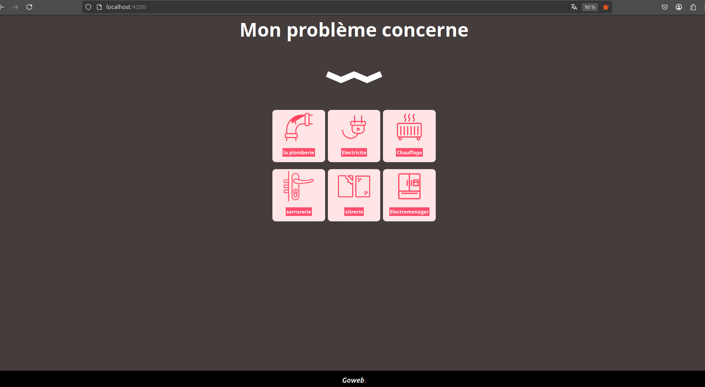
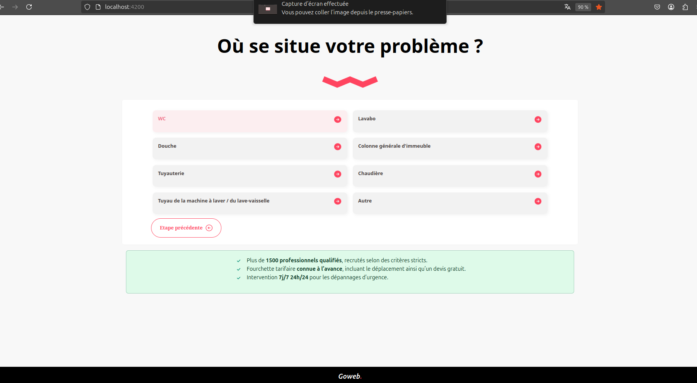
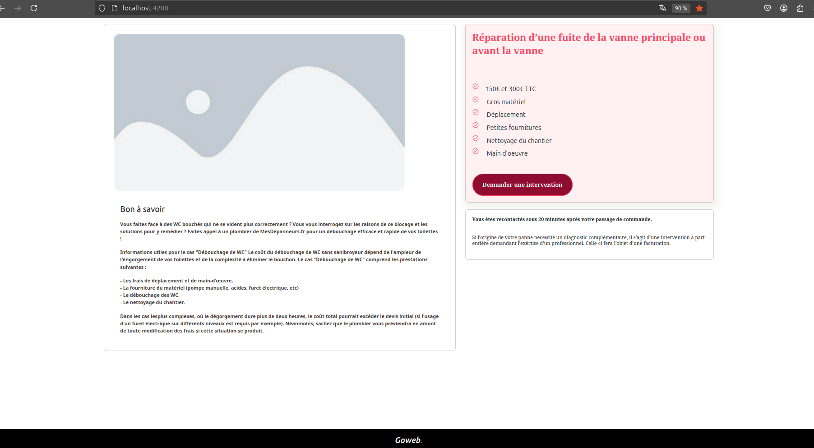
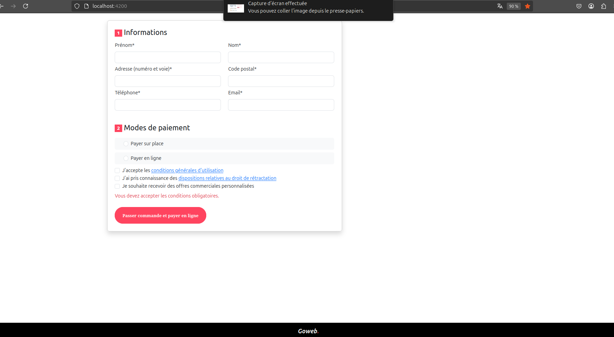

# Projet Goweb

## Description du projet

Ce projet est un formulaire dynamique permettant de qualifier un chantier de dépannage. Il inclut un système de question-réponse interactif où les questions affichées dépendent des réponses précédentes. L'utilisateur peut également renseigner ses coordonnées pour être recontacté.

### Fonctionnalités Implémentées

- Interface utilisateur en Angular pour la saisie des détails du chantier
- Validation des champs côté client avec Angular et les classes Bootstrap
- Possibilité de revenir en arrière
- Sauvegarde des réponses pour transmission dans le formulaire final

### Technologies Utilisées

- **Angular 19** pour la partie front-end
- **Bootstrap 5** pour le style
- **Docker** pour lancer les services
- **Express.js** comme serveur backend
- **MongoDB** comme base de données
- **DataTables.js** pour afficher les réponses des clients

## Installation et Exécution

### Prérequis

- **Node.js** installé sur votre machine
- **Angular CLI** installé sur votre machine
- **npm**

### Lancer le Backend et la Base de Données :

1. Placez-vous dans le dossier racine du projet `/` et exécutez la commande suivante :

   ```bash
    docker-compose up -d
   ```

   Cette commande lance le backend, le restore des données et la base de données à partir du dossier `backup`.

### Lancement du Frontend

1. Assurez-vous d'avoir les prérequis listés au début de ce document.
2. Exécutez les commandes suivantes dans le repertoire `/front` pour lancer le frontend :

   ```bash
   npm install
   ```

   ```bash
   ng serve
   ```

### Pour Tester le Formulaire

Rendez-vous à l'adresse suivante dans votre navigateur pour voir et interagir avec le formulaire :

- `http://localhost:4200/`

## Problèmes Rencontrés

- **Problème CORS** : Il y a un problème CORS au niveau du backend Express.js. C'est pour cette raison que le frontend sera lancé localement sur votre machine.
- **Récupération des réponses des clients** (ex. WC, Douche, etc.) : Bien que la fonctionnalité de sauvegarde des réponses fonctionne côté backend, la restitution des données dans le frontend n'a pas été implémentée en raison de contraintes de temps.

## Résultats

### Accueil



### Questions



### Bon à Savoir



### Formulaire Client


